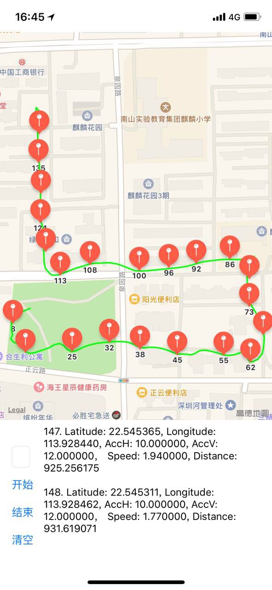
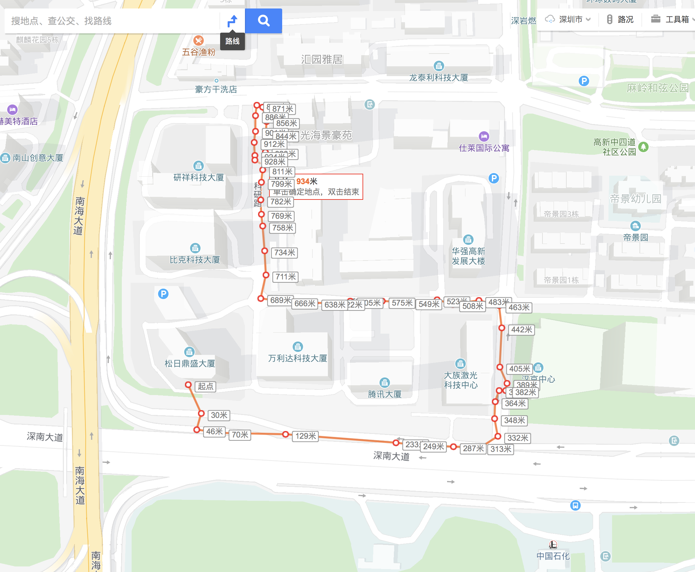

## 介绍

这是一个计算、优化跑步路径的GPS库。在计算点的偏移过程中使用了“域”的概念，并根据精度自动调整域的大小。

在解决了部分偏移问题之后，为了Android的兼容，使用C++编写了卡尔曼滤波器（Kalman Filter），对路径点进一步优化。

## 使用方法

QMRunningLocationManager.h 文件中有符合Xcode doc的文档注释，可以直接使用Option键查看。

卡尔曼滤波器的C++头文件 QMKalmanFilter.h 文件中有卡尔曼滤波器的使用方法。主要的输入参数为：精度、纬度、高度、当前时间（用于计算速度）。

## 参数调整

- 卡尔曼滤波器的参数 Sigma rValue

- 域的大小和精度的比率 ratio

- QMLocationManagerConfiguration 中的参数，均有详细注释

## 演示

下面第一张图是我的算法，第二张是百度地图的结果，距离差在可接受范围之内，目前代码已经提交到trunk分支准备上线。

  

  

